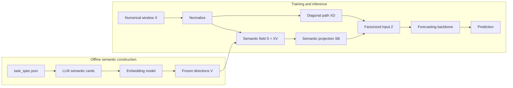

<div align="center">

# TSF

### LLM-Guided Task-Semantic Field Factorization for Industrial Process Forecasting

**A semantic input factorization layer for industrial forecasting and soft sensing.**

[](paper/TSF-Arxiv.pdf)
[](https://www.python.org/)
[](https://pytorch.org/)
[](#datasets)
[](https://github.com/mituan-ai/TSF_open)
[](LICENSE)
[](https://numpy.org/)
[](https://docs.astral.sh/uv/)

**English** · [简体中文](README_CN.md)

[Overview](#overview) · [Quick Start](#quick-start) · [Method](#method) · [Datasets](#datasets) · [Usage](#usage) · [Paper](#paper)

</div>

## Overview

TSF incorporates task and variable descriptions into industrial time-series models. An LLM organizes the descriptions before training, an embedding model converts them into frozen semantic directions, and the forecasting model activates those directions from each numerical input window.

- **Offline semantic construction:** LLM and embedding calls are separated from model training and inference.
- **Shape-preserving factorization:** the TSF layer combines a numerical residual path with a semantic projection while retaining the original input shape.
- **Reusable experiments:** the repository includes four processed datasets, frozen semantic artifacts, baseline configurations, and TSF configurations.

## Requirements

| Component | Requirement |
| --- | --- |
| Python | `>=3.14` |
| Environment manager | `uv` recommended |
| Core dependency | NumPy |
| Training dependencies | PyTorch, scikit-learn, Transformers, and `kernels` |
| GPU | Optional; use CUDA for full training when available |

## Quick Start

```bash
git clone https://github.com/mituan-ai/TSF_open.git
cd TSF_open
uv sync --extra train
uv run --extra train python scripts/train_forecaster.py \
  --config configs/experiments/indpensim_gru_tsf.yaml \
  --max-epochs 1 --device cpu
```

Results are saved under `outputs/runs/`.

## Method

For a normalized input window `X ∈ ℝ^(L×d)` and frozen semantic directions `V ∈ ℝ^(d×k)`:

```text
Semantic field       S = X V
Factorized input     Z = X D + S B + b
Forecast             ŷ = Backbone(Z)
```

- `D` is a trainable diagonal residual path for the numerical variables.
- `B` projects semantic activations back to the original `d` input channels.
- `Z` has the same shape as `X` and can be passed to the supported forecasting backbones.
- The included semantic artifacts use `k = 128`.



Supported backbones are GRU, LSTM, Transformer, Informer, Mamba, iTransformer, PatchTST, and ModernTCN. The included experiment configurations use GRU.

## Datasets

Each dataset directory contains a processed `windows.npz` bundle, a `task_spec.json` describing the forecasting task and variables, and dataset-specific protocol notes.

| Dataset | Task | Input → target | Samples | Origin |
| --- | --- | --- | ---: | --- |
| [`ladle_preheating`](resources/datasets/ladle_preheating/README.md) | Multi-step ladle temperature forecasting | `(60, 14) → (5,)` | 19,840 | Processed field data |
| [`thickener_dewatering`](resources/datasets/thickener_dewatering/README.md) | Underflow concentration soft sensing | `(30, 5) → (1,)` | 5,149 | Simulation data |
| [`indpensim`](resources/datasets/indpensim/README.md) | Offline penicillin concentration soft sensing | `(120, 23) → (1,)` | 818 | [Mendeley Data](https://doi.org/10.17632/pdnjz7zz5x) |
| [`tennessee_eastman`](resources/datasets/tennessee_eastman/README.md) | Delayed product-G composition soft sensing | `(20, 33) → (1,)` | 47,775 | [Harvard Dataverse](https://doi.org/10.7910/DVN/6C3JR1) |

Each `windows.npz` contains:

| Array | Content |
| --- | --- |
| `windows` | Float32 inputs with shape `(samples, time, features)` |
| `targets` | Float32 regression targets |
| `sample_metadata_json` | Sample-level split and scenario metadata |
| `metadata_json` | Feature order, target definition, source, and protocol metadata |

## Usage

Run an experiment by selecting one of the included configurations:

```bash
uv run --extra train python scripts/train_forecaster.py \
  --config configs/experiments/<config>.yaml \
  --device cuda
```

| Dataset | Baseline | TSF |
| --- | --- | --- |
| IndPenSim | `indpensim_gru.yaml` | `indpensim_gru_tsf.yaml` |
| Ladle preheating | `ladle_preheating_gru.yaml` | `ladle_preheating_gru_tsf.yaml` |
| Thickener dewatering | `thickener_dewatering_gru.yaml` | `thickener_dewatering_gru_tsf.yaml` |
| Tennessee Eastman | `tennessee_eastman_gru.yaml` | `tennessee_eastman_gru_tsf.yaml` |

Each run records the resolved configuration, normalization statistics, data splits, checkpoint, predictions, metrics, timing, memory use, and logs.

## Semantic Resources

The included experiment configurations load frozen semantic resources from:

```text
resources/semantic_artifacts/<dataset>/
├── directions.npy
└── semantic_field_metadata.json
```

To construct semantic resources for a new task, configure the LLM and embedding provider in `configs/env/api.local.env`, then run both stages:

```bash
cp configs/env/api.env configs/env/api.local.env

uv run --extra llm python scripts/build_semantic_cards.py \
  --task-spec path/to/task_spec.json \
  --call-api \
  --output-dir outputs/semantics/my_task

uv run --extra llm python scripts/build_semantic_artifact.py \
  --semantic-cards outputs/semantics/my_task/semantic_cards.json \
  --output-dir outputs/semantic_artifacts/my_task
```

Generation settings are defined in `configs/llm.yaml` and `configs/embedding.yaml`.

## Paper

**LLM-Guided Task-Semantic Field Factorization for Industrial Process Forecasting**<br>
Youcheng Zong, Runda Jia, Mingxuan Ren, and Dakuo He

[Read the paper](paper/TSF-Arxiv.pdf)

The paper evaluates TSF on ladle preheating, thickener dewatering, and IndPenSim. This repository also includes a Tennessee Eastman Process dataset protocol and example configuration.

## Citation

```bibtex
@misc{zong2026tsf,
  title  = {LLM-Guided Task-Semantic Field Factorization for Industrial Process Forecasting},
  author = {Youcheng Zong and Runda Jia and Mingxuan Ren and Dakuo He},
  year   = {2026},
  note   = {Preprint},
  url    = {https://github.com/mituan-ai/TSF_open}
}
```

## Development

```bash
uv sync --extra dev --extra train
uv run --extra train pytest -q
```

## License

Code is released under the [MIT License](LICENSE). Datasets derived from public sources remain subject to their original terms and citation requirements.
