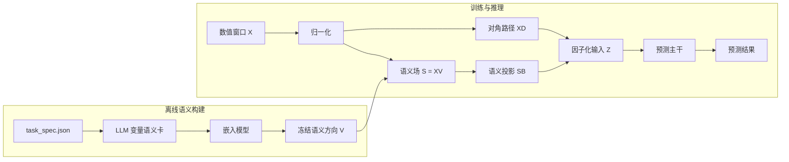

<div align="center">

# TSF

### 大语言模型引导的工业过程预测任务语义场因子化

**面向工业预测与软测量的语义输入因子化层。**

[](paper/TSF-Arxiv.pdf)
[](https://www.python.org/)
[](https://pytorch.org/)
[](#数据集)
[](https://github.com/mituan-ai/TSF_open)
[](LICENSE)
[](https://numpy.org/)
[](https://docs.astral.sh/uv/)

[English](README.md) · **简体中文**

[项目概览](#项目概览) · [快速开始](#快速开始) · [方法](#方法) · [数据集](#数据集) · [使用方法](#使用方法) · [论文](#论文)

</div>

## 项目概览

TSF 将任务说明和变量描述引入工业时间序列模型。大语言模型在训练前整理这些描述，嵌入模型将其转换为冻结语义方向，预测模型再根据每个数值输入窗口激活相应的语义信息。

- **离线构建语义：** 大语言模型和嵌入接口独立于模型训练与推理。
- **保持输入形状：** TSF 将数值残差路径与语义投影结合，不改变原始输入形状。
- **提供完整示例：** 仓库包含四个处理后数据集、冻结语义资源、基线配置和 TSF 配置。

## 环境要求

| 组件 | 要求 |
| --- | --- |
| Python | `>=3.14` |
| 环境管理 | 推荐使用 `uv` |
| 基础依赖 | NumPy |
| 训练依赖 | PyTorch、scikit-learn、Transformers 和 `kernels` |
| GPU | 可选；条件允许时建议使用 CUDA 完成正式训练 |

## 快速开始

```bash
git clone https://github.com/mituan-ai/TSF_open.git
cd TSF_open
uv sync --extra train
uv run --extra train python scripts/train_forecaster.py \
  --config configs/experiments/indpensim_gru_tsf.yaml \
  --max-epochs 1 --device cpu
```

运行结果保存在 `outputs/runs/`。

## 方法

给定归一化输入窗口 `X ∈ ℝ^(L×d)` 和冻结语义方向 `V ∈ ℝ^(d×k)`：

```text
语义场           S = X V
因子化输入       Z = X D + S B + b
预测结果         ŷ = Backbone(Z)
```

- `D` 是作用于数值变量的可训练对角残差路径。
- `B` 将语义激活投影回原来的 `d` 个输入通道。
- `Z` 与 `X` 形状相同，可直接传入仓库支持的预测主干。
- 仓库提供的语义资源采用 `k = 128`。



仓库支持 GRU、LSTM、Transformer、Informer、Mamba、iTransformer、PatchTST 和 ModernTCN；现有实验配置采用 GRU。

## 数据集

每个数据集目录均包含处理后的 `windows.npz`、描述预测任务与变量的 `task_spec.json`，以及对应的数据和评测协议说明。

| 数据集 | 任务 | 输入 → 目标 | 样本数 | 来源 |
| --- | --- | --- | ---: | --- |
| [`ladle_preheating`](resources/datasets/ladle_preheating/README.md) | 钢包预热多步温度预测 | `(60, 14) → (5,)` | 19,840 | 处理后现场数据 |
| [`thickener_dewatering`](resources/datasets/thickener_dewatering/README.md) | 浓密脱水底流浓度软测量 | `(30, 5) → (1,)` | 5,149 | 仿真数据 |
| [`indpensim`](resources/datasets/indpensim/README.md) | 离线青霉素浓度软测量 | `(120, 23) → (1,)` | 818 | [Mendeley Data](https://doi.org/10.17632/pdnjz7zz5x) |
| [`tennessee_eastman`](resources/datasets/tennessee_eastman/README.md) | 延迟产品组分 G 软测量 | `(20, 33) → (1,)` | 47,775 | [Harvard Dataverse](https://doi.org/10.7910/DVN/6C3JR1) |

每个 `windows.npz` 包含：

| 数组 | 内容 |
| --- | --- |
| `windows` | 形状为 `(samples, time, features)` 的 float32 输入窗口 |
| `targets` | float32 回归目标 |
| `sample_metadata_json` | 样本级数据划分和场景信息 |
| `metadata_json` | 变量顺序、目标定义、数据来源和协议信息 |

## 使用方法

选择仓库中的实验配置运行训练：

```bash
uv run --extra train python scripts/train_forecaster.py \
  --config configs/experiments/<config>.yaml \
  --device cuda
```

| 数据集 | 基线 | TSF |
| --- | --- | --- |
| IndPenSim | `indpensim_gru.yaml` | `indpensim_gru_tsf.yaml` |
| 钢包预热 | `ladle_preheating_gru.yaml` | `ladle_preheating_gru_tsf.yaml` |
| 浓密脱水 | `thickener_dewatering_gru.yaml` | `thickener_dewatering_gru_tsf.yaml` |
| Tennessee Eastman | `tennessee_eastman_gru.yaml` | `tennessee_eastman_gru_tsf.yaml` |

每次运行都会保存最终配置、归一化统计、数据划分、模型检查点、预测结果、评测指标、耗时、内存占用和日志。

## 语义资源

现有实验配置从以下目录读取冻结语义资源：

```text
resources/semantic_artifacts/<dataset>/
├── directions.npy
└── semantic_field_metadata.json
```

为新任务构建语义资源时，先在 `configs/env/api.local.env` 中配置大语言模型和嵌入服务，再依次运行两个阶段：

```bash
cp configs/env/api.env configs/env/api.local.env

uv run --extra llm python scripts/build_semantic_cards.py \
  --task-spec path/to/task_spec.json \
  --call-api \
  --output-dir outputs/semantics/my_task

uv run --extra llm python scripts/build_semantic_artifact.py \
  --semantic-cards outputs/semantics/my_task/semantic_cards.json \
  --output-dir outputs/semantic_artifacts/my_task
```

生成参数在 `configs/llm.yaml` 和 `configs/embedding.yaml` 中定义。

## 论文

**LLM-Guided Task-Semantic Field Factorization for Industrial Process Forecasting**<br>
Youcheng Zong、Runda Jia、Mingxuan Ren、Dakuo He

[阅读论文](paper/TSF-Arxiv.pdf)

论文在钢包预热、浓密脱水和 IndPenSim 上评估 TSF。本仓库还提供 Tennessee Eastman Process 的数据协议和示例配置。

## 引用

```bibtex
@misc{zong2026tsf,
  title  = {LLM-Guided Task-Semantic Field Factorization for Industrial Process Forecasting},
  author = {Youcheng Zong and Runda Jia and Mingxuan Ren and Dakuo He},
  year   = {2026},
  note   = {Preprint},
  url    = {https://github.com/mituan-ai/TSF_open}
}
```

## 开发验证

```bash
uv sync --extra dev --extra train
uv run --extra train pytest -q
```

## 许可

代码采用 [MIT License](LICENSE)。源自公开数据集的内容仍遵循原始许可和引用要求。
